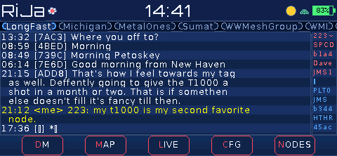
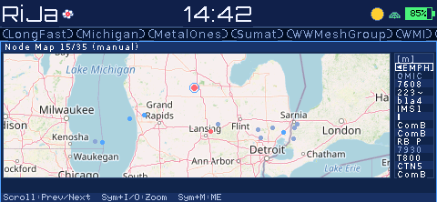
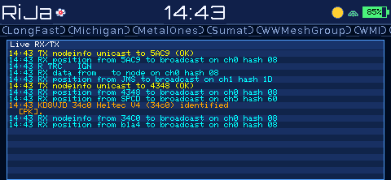
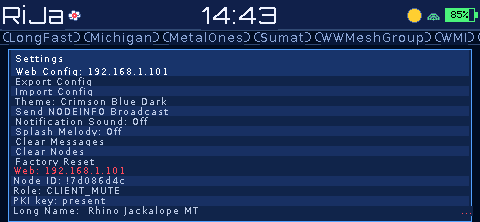
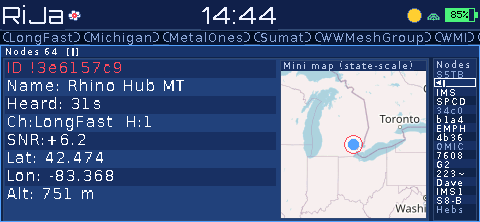

# Camillia MT Use Guide

This guide shows the main screens and basic actions.

## 1. Chat screen

Use this screen to read channel messages and send quick replies.

- The bottom tabs switch between major views.
- The chat list is in the center.
- The input line is near the bottom.

## 2. Map screen

Use this screen to view node locations.

- Open the MAP tab.
- Use zoom controls to move in and out.
- Use the "ME" action to center on your node.

## 3. Live screen

Use this screen for real-time radio and routing activity.

- Open the LIVE tab.
- Watch packet and route events as they appear.
- Use this when checking network flow.

## 4. Config screen

Use this screen to view settings and device information.

- Open the CFG tab.
- Review Web Config address, role ID, and node ID.
- Use clear and reset actions carefully.

## 5. Node details screen

Use this screen to inspect one node in detail.

- Open the NODES tab and select a node.
- Review signal quality, location, and channel.
- The mini map shows the selected node position.

## Quick flow

1. Start in Chat.
2. Open Map to check positions.
3. Open Live to confirm traffic.
4. Open Config for setup values.
5. Open Nodes for per-node details.

## Controls

### LilyGo T-Deck (`tdeck`)

Keyboard and hardware controls:
- Trackball left and right: previous and next channel or tab.
- Trackball up and down: scroll messages or panel lists.
- Trackball click: confirm selection.
- Enter: start compose or send, depending on context.
- Backspace: delete one character.
- Tab: cycle focus between message pane and node list.
- Alt + E: toggle node list focus.
- Panel shortcuts when not typing: `D` DM, `M` MAP, `L` LIVE, `C` CFG, `N` NODES.

Map keyboard shortcuts:
- Symbol + I: zoom in.
- Symbol + O: zoom out.
- Symbol + M: center on your node.

On-screen controls:
- Bottom buttons: Prev, DM, MAP, LIVE, CFG, NODES, Next.
- MAP buttons: Previous Node, Next Node, `+`, `-`, `ME`.

### LilyGo T-Lora Pager TFT (`tlora-pager-tft`)

Keyboard and wheel controls:
- Roller up and down: switch channel or tab in channel view.
- Roller click: toggle row-cursor mode in channel view.
- In row-cursor mode, roller up and down: move through message rows.
- Enter: start compose or send, depending on context.
- Backspace: delete one character.
- Tab: cycle focus between message pane and node list.
- Alt + E: toggle node list focus.
- Panel shortcuts when not typing: `D` DM, `M` MAP, `L` LIVE, `C` CFG, `N` NODES.

Map keyboard shortcuts:
- Symbol + I: zoom in.
- Symbol + O: zoom out.
- Symbol + M: center on your node.

On-screen controls:
- Bottom buttons: DM, MAP, LIVE, CFG, NODES.
- MAP buttons: Previous Node, Next Node, `+`, `-`, `ME`.

### M5Stack Cardputer + Cap LoRa/GPS (`cardputer-cap`)

Keyboard controls:
- Enter: start compose or send, depending on context.
- Backspace: delete one character.
- Tab: cycle focus between message pane and node list.
- Alt + E: toggle node list focus.
- Fn + `;`: scroll up.
- Fn + `.`: scroll down.
- Fn + `,`: previous channel.
- Fn + `/`: next channel.
- Panel shortcuts when not typing: `D` DM, `M` MAP, `L` LIVE, `C` CFG, `N` NODES.

Map keyboard shortcuts:
- `;`: previous node.
- `.`: next node.
- `,`: zoom out.
- `/`: zoom in.

On-screen controls:
- No touch controls in this build profile.

### Heltec WiFi LoRa 32 V4 + TFT expansion (`heltec-v4`, `heltec-v4-vertical`)

Touch controls:
- Bottom buttons: Prev, DM, MAP, LIVE, CFG, NODES, Next.
- MAP buttons: Previous Node, Next Node, `+`, `-`, `ME`.
- DM panel: on-screen Up and Down buttons.
- NODES panel: on-screen Up and Down buttons.
- CFG panel: on-screen Up and Down buttons.
- Tap the input area in message views to open the on-screen keyboard.

Keyboard controls:
- No physical keyboard controls in this build profile.
