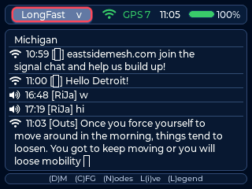
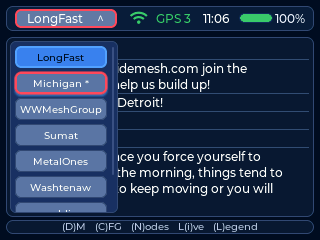
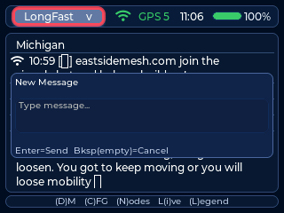
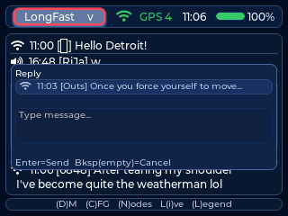
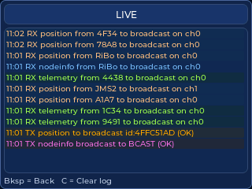
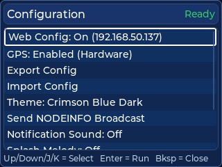
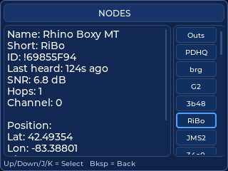
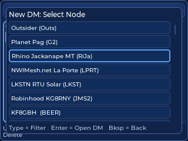
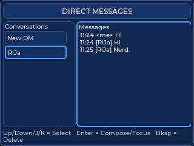

# Camillia for Meshtastic Use Guide

This guide reflects current firmware navigation and controls.

## Main screen

The main screen is channel chat. Use it to read traffic, select reply targets, and start compose.

Typical flow on keyboard builds: pick a channel, press **Enter** to move the
cursor into that channel's messages, scroll to a message to select it, then press
**Space** to compose (a reply if a row is selected, otherwise a new message).

## Keyboard shortcuts by build

### Shared shortcuts (keyboard builds)

These apply to all keyboard builds: `tdeck`, `tlora-pager-tft`, and `cardputer-cap`.

- D opens Direct Messages
- C opens Config
- N opens Nodes
- L opens Live
- A opens Channel Actions
- **Space opens compose** — a new message, or a reply when a chat row is
  selected. Space replaced Enter for this on both the chat and DM screens.
- **Enter moves the cursor into the messages** — on chat it drops into the
  selected channel's messages; in the DM list it focuses the conversation's
  messages. Enter never opens compose.
- Note: inside the compose box, Enter still **sends** the message.
- Live modal shortcuts: C clears the log, U opens channel-util chart, S opens SNR/RSSI chart

### LilyGo T-Deck (tdeck)

- H toggles the channel selector
- J/K map to Up/Down navigation in lists and chat row selection
- Trackball Up/Down follows the same Up/Down behavior as J/K
- Modal close key is Backspace (Esc is also accepted)
- DM delete trigger on selected conversation: Backspace
- Compose close behavior: Backspace on an empty compose closes the compose modal
- Trackball click hold for 2 seconds puts the screen to sleep

### LilyGo T-Lora Pager TFT (tlora-pager-tft)

- H toggles the channel selector
- Wheel Up/Down on main chat switches channels
- Wheel Click enters/exits chat row cursor mode (Enter does the same thing)
- In chat row cursor mode, Wheel Up/Down moves the selected chat row
- Backspace exits chat row cursor mode
- Config modal: I focuses the info panel; Wheel Click swaps focus between actions/info
- DM modal: Wheel Click swaps focus between conversation and message panels
- Modal close key is Backspace (Esc is also accepted)
- DM delete trigger on selected conversation: Backspace (including Symbol+Backspace / hold path)
- Compose close behavior: Backspace on an empty compose closes the compose modal

### M5Stack Cardputer + Cap LoRa/GPS (cardputer-cap)

- H toggles the channel selector
- Channel switch: comma (previous), slash (next)
- Navigation: semicolon (Up), period (Down)
- Arrow keys map to the same directional actions
- Esc closes modals and exits chat-focus modes
- Enter confirms actions and moves the cursor into the channel's messages;
  Space opens compose, and Fn+Enter is also accepted for the compose/reply flow
- DM delete trigger on selected conversation: Fn+Backspace
- Compose close behavior: Esc closes compose (Backspace only deletes characters)

### Heltec WiFi LoRa 32 V4 + TFT expansion

Builds: `heltec-v4`, `heltec-v4-vertical`

- Primary usage is touch (no dedicated hardware keyboard shortcuts)
- Bottom touch nav: Config, DM, Nodes, Live, Help
- DM delete trigger: long-press a conversation row
- The Space/Enter remap above does **not** apply here: this build is touch-first,
  so Enter keeps its original "new message" behavior






## Live screen

Live shows decoded RX and TX traffic with per-traffic coloring.

- Open from the main screen (L on keyboard builds, Live bottom-nav button on Heltec)
- Scroll with Up and Down input
- Press C to clear the log
- Close with the device close key (see device sections below)



## Config screen

Config includes Web Config controls, export and import, theme toggles, announce, and reset actions.

- Open from the main screen (C on keyboard builds, Config bottom-nav button on Heltec)
- Navigate action rows with Up and Down input
- Enter runs the selected action
- Keyboard builds: I opens/focuses the info panel within Config
- Import, Clear Nodes, and Factory Reset require a second Enter confirmation

### Information panel

The device info panel is scrollable with the keyboard on every keyboard build:

- **T-Lora Pager** — I focuses the info panel (Wheel Click also swaps between the
  action and info panels), Wheel Up/Down scrolls it, Backspace returns to the
  action list without closing Config
- **T-Deck** — I opens the info popup, J/K (or the trackball) scroll it, and I or
  Backspace closes it
- **Cardputer** — I opens the info popup, Up/Down (or semicolon/period) scroll it,
  and I or Esc closes it
- **Heltec** — touch-first; the popup is dismissed by any key or by tapping

### Notification sound

**Notification Sound** opens a picker (same navigation as Chat Style) with
Default, Chirpy, Bass, and Off. Moving the selection **plays that tone as a
preview**, so you can hear each one before committing. Enter applies the
highlighted tone; Backspace/Esc cancels and restores whatever was set before you
opened the picker, so previewing never changes your setting by accident. On
touch builds, tapping a row previews it and tapping it again applies it.

Notification Sound and Splash Melody now sit directly under My Message Color,
with the other presentation settings.

### Node management

The device keeps a fixed number of the most recently heard nodes (250 on current
builds). When that fills up, the **least recently heard non-favorite** is dropped
to make room — **favorited nodes are never dropped, however old they are**.

Optionally, dropped nodes can be preserved instead of discarded. In Web Config,
**Node Management** has an *Archive dropped nodes to SD card* checkbox:

- It is **off by default** — archiving only happens if you turn it on
- It cannot be enabled on a board with no SD slot, or with no card inserted; the
  reason is shown in place of the description
- When on, each dropped node is appended to `/camillia/nodes_archive.csv`

The same section has an **Export Node List (CSV)** button, which downloads every
node the device currently knows about plus any previously archived nodes. A
`source` column marks each row as `live` or `archived`.

The Config info panel also shows the **Newest** and **Oldest** node heard since
boot, with the node name and the time it was last heard.

### Auto-favorite nearby nodes

Also under **Node Management** in Web Config:

- **Auto-favorite nearby nodes** — off by default, opt-in
- **Auto-favorite radius** — in km or miles, following your Units setting
  (stored internally in meters, so switching units re-displays the same distance)

When enabled, any node reporting a position within the radius is favorited
automatically. This matters beyond sorting: favorites are never dropped when the
node table fills up, so this is a way to automatically protect your local nodes.

Two deliberate limits:

- It only ever **adds** favorites. A node moving out of range is never
  un-favorited — otherwise it could silently undo a favorite you set by hand.
  Remove those yourself from the node Actions menu.
- It needs a known position for **both** your node and theirs. With no GPS fix
  it falls back to your configured fixed position; nodes that have never sent a
  position are skipped.

The check runs every 30 seconds, so it also picks up nodes as *you* move.

### Firmware update check on boot

Once per boot, after WiFi comes up and settles, the device asks the release
server whether a newer build exists. If one does, a dialog shows the jump:

```
Firmware Update
3.4.1 -> 3.5.0
```

**Yes** reboots into OTA minimal mode and installs it (the same path as the
Config screen's Firmware Update action, including signature verification).
**No** dismisses it for the rest of this boot — it will not ask again until you
reboot. On keyboard builds, `Y`/Enter accepts and `N`/close declines.

Web Config → **Firmware Updates** → *Check for Updates on Boot* turns the check
off. It defaults to on. The check is a single plain-HTTP request and is skipped
entirely when WiFi is off or unreachable; a failed check is not retried until
the next boot. The update source is fixed in firmware and is not configurable.

Not available on the Cardputer, where OTA is disabled altogether.

### Update channel

**Update Channel** — in the Config screen and Web Config → **Firmware Updates** —
picks which stream OTA follows:

- **Release** (default) — tracks the latest stable build.
- **Alpha** — tracks the latest prerelease (alpha) build: new features sooner, at
  the cost of rougher edges. Every stable release also publishes a matching alpha,
  so the alpha channel is always at least as new as stable.

The channel affects both the boot check and the Config screen's Firmware Update
action. Switching channels re-tracks on the next check, even when that means
moving to a lower version number: selecting **Release** while running an alpha
installs the latest stable (so you leave the alpha stream cleanly), and selecting
**Alpha** while on a stable build moves you onto the newest alpha.

On the Config screen the setting toggles between the two; in Web Config it's a
dropdown. Not available on the Cardputer (OTA disabled).

### Chat style

Config has a **Chat Style** action. Selecting it opens a picker modal — navigate
with the usual up/down input and press Enter (or tap) to choose Classic,
Bubbles, or Outline; Backspace/Esc cancels. Choosing a *different* style reboots
to apply it; re-choosing the current style just closes without a reboot.

- **Classic** — one flat, colored text line per message
- **Bubbles** — per-message rounded bubbles with a solid fill; your messages are
  right-aligned in the accent color (turning green on ACK, red on failure),
  other nodes' are left-aligned in a stable per-node color with a short-name tag
- **Outline** — the same bubbles drawn as colored outlines over a transparent
  fill: the per-node/accent color becomes the border (and the ACK/fail color for
  your sent messages), the sender tag is tinted to match, and the message text
  uses the theme's normal high-contrast color for readability

The style applies to both **channel chat and Direct Messages**. The Web Config
**Chat Style** dropdown offers the same three choices. All three styles are
available on every build, including the Cardputer.

### Emoji

Received emoji render as monochrome glyphs inline with the message text, on
every build. Coverage is broad — the firmware carries the full Noto Emoji set
(~1,500 glyphs) as a flash-resident font, drawn at the current text size. Two
notes on the monochrome approach:

- Emoji are **single-color**, matching the surrounding text — not full color.
- Multi-part sequences aren't combined: a skin-tone or variation selector is
  dropped to the base emoji, and a family/flag ZWJ sequence shows its component
  emoji side by side. Each piece still renders.

To **send** an emoji from the device, use the quick-emoji tray. On keyboard
builds (T-Deck, Pager, Cardputer), from the chat or DM screen — **not** while
composing a message — press **E**. A tray of common emoji opens: move the
selection and press Enter (or tap) to **send that emoji immediately** as a
one-glyph message, then the tray closes. On the channel view it goes to the
active channel; on the DM view it goes to the selected conversation. A close key
or a tap outside dismisses the tray without sending.

- **T-Deck / Pager / Cardputer** — press **E** on the chat/DM screen
- **Heltec (touch)** — while composing, tap the 😀 button next to Cancel / Send
  to insert emoji into the message

The web-config composer can also send any emoji your browser can type.

### Chat names

Config also has a **Chat Names** action, which opens a picker (same navigation as
Chat Style) to choose how sender names appear in channel chat:

- **Short** — the node's 4-character short name (e.g. `ABCD`)
- **Long** — the node's full advertised name when one is known, otherwise it
  falls back to the short name / hex id

Unlike Chat Style, this applies **without a reboot**: bubble views re-render
immediately, and new classic-chat lines use the chosen style going forward. The
Web Config **Chat Names** dropdown offers the same two choices.



## Nodes screen

Nodes shows discovered nodes and detail fields, including map position details.

- Open from the main screen (N on keyboard builds, Nodes bottom-nav button on Heltec)
- Navigate rows with Up and Down input (T-Deck uses J/K, since it has no Up/Down buttons)
- Enter opens the actions menu for the selected node
- Close with the device close key

### Filtering nodes

- Space starts the filter. Filter brackets `[ ]` appear in the header as a visual
  cue that filtering is on, even before you type anything
- Once the filter is armed, type to narrow the list; the text shows inside the
  brackets (`NODES [text] (count)`)
- Typing a letter on its own no longer starts the filter — only Space does
- Backspace edits the filter text; backspacing past the last character closes the
  filter and clears the brackets



## Direct Messages

Direct messaging:

- Open from the main screen (D on keyboard builds, DM bottom-nav button on Heltec)
- Pressing Enter on New DM opens node picker
- Enter on a conversation focuses the message panel (it stops there — Enter never
  opens compose)
- Space opens compose for the focused DM (Space replaced Enter for new messages)
- DM messages honor the Bubbles chat style: your messages are right-aligned in
  the accent/ack color, the other node's are left-aligned in their node color



Delete behavior:
- T-Deck and T-Lora Pager: Backspace triggers delete confirmation on selected conversation
- Cardputer: Fn+Backspace triggers delete confirmation on selected conversation
- Heltec touch build: long-press a conversation row for delete confirmation

## Help screen

Help explains shortcuts and transport symbols.

- Heltec: open from the bottom Help nav button
- While Help is open, D, C, N, and L jump directly into those screens

## Compose behavior

- Enter sends
- Space types a space — the Space shortcut only opens compose from the chat/DM
  screens, never while you are typing in the compose box
- Backspace deletes a character
- Cardputer: Esc closes compose
- T-Deck and T-Lora Pager: Backspace on empty compose closes
- Heltec: use on-screen controls to close compose

## Device controls

### LilyGo T-Deck (tdeck)

Primary usage is touch plus keyboard shortcuts.

- Use touch for channel chips and UI buttons
- D, C, N, L open main modals; A opens Channel Actions
- H toggles channel selector
- Space opens compose or reply compose; Enter moves the cursor into the channel's messages
- Optional Vim-style helpers in navigation views: J maps to Up and K maps to Down
- Modal close key: Backspace (Esc also works)

### LilyGo T-Lora Pager TFT (tlora-pager-tft)

Primary usage is wheel plus keyboard.

- Wheel Up and Down on chat switches channels
- Wheel Click enters/exits row cursor mode
- In row cursor mode, Wheel Up and Down moves selected chat row
- Backspace exits row cursor mode
- Space opens compose or reply compose; Enter moves the cursor into the channel's messages
- H toggles channel selector
- Config modal: Wheel Click swaps focus between action list and info panel
- DM modal: Wheel Click swaps focus between conversation list and message list
- Modal close key: Backspace (Esc also works)

### M5Stack Cardputer + Cap LoRa/GPS (cardputer-cap)

Primary usage is keyboard.

- Channel switch: comma for previous, slash for next
- Navigation: semicolon and period act as Up and Down in list views
- Arrow keys map to the same directional actions
- H toggles channel selector
- Escape closes modals and exits chat focus mode
- Space (or Fn+Enter) opens compose; Enter confirms selected actions and moves the cursor into the channel's messages
- Fn+Backspace is the DM delete trigger

### Heltec WiFi LoRa 32 V4 + TFT expansion (heltec-v4, heltec-v4-vertical)

Primary usage is touch.

- Bottom touch nav provides Config, DM, Nodes, Live, and Help
- Use on-screen touch lists and buttons inside each modal

## Close key summary

- Cardputer label: Esc
- T-Deck and T-Lora Pager label: Bksp
- Heltec touch: use on-screen navigation and close controls

Esc is accepted as a close key in most keyboard flows.
