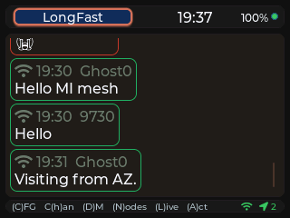
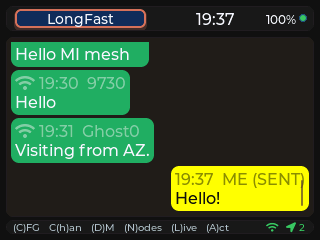
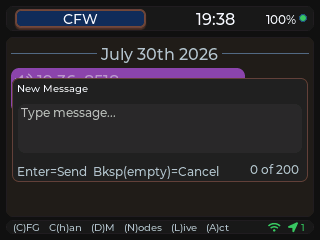
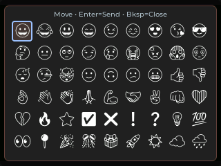
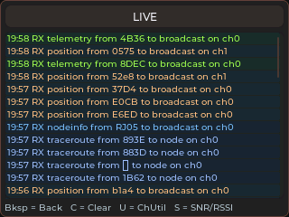
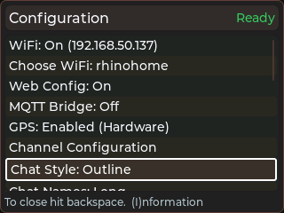
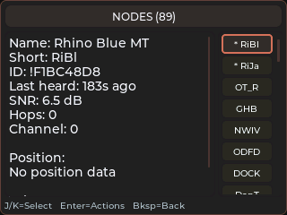
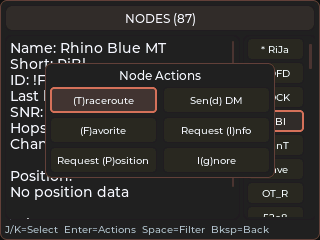
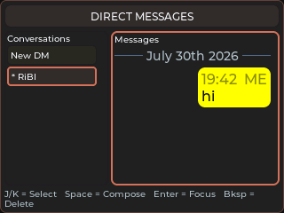

# Camillia for Meshtastic Use Guide

This guide reflects current firmware navigation and controls.

## Main screen

The main screen is channel chat. Use it to read traffic, select reply targets, and start compose.

Typical flow on keyboard builds: pick a channel, press **Enter** to move the
cursor into that channel's messages, scroll to a message to select it, then press
**Space** to compose (a reply if a row is selected, otherwise a new message).

## Keyboard shortcuts by build

### Shared shortcuts (keyboard builds)

These apply to all keyboard builds: `tdeck`, `tlora-pager-tft`, and `cardputer-cap`.

- D opens Direct Messages
- C opens Config
- N opens Nodes
- L opens Live
- A opens Channel Actions — M mutes/unmutes the channel, L toggles whether this
  node broadcasts its position on it (Share Location in Config gates all channels)
- **Space opens compose** — a new message, or a reply when a chat row is
  selected. Space replaced Enter for this on both the chat and DM screens.
- **Enter moves the cursor into the messages** — on chat it drops into the
  selected channel's messages; in the DM list it focuses the conversation's
  messages. Enter never opens compose.
- Note: inside the compose box, Enter still **sends** the message.
- Live modal shortcuts: C clears the log, T opens the Tools modal (SNR/RSSI, ChUtil, and Discovery except on Cardputer); S sweeps inside Discovery

### LilyGo T-Deck (tdeck)

- H toggles the channel selector
- J/K map to Up/Down navigation in lists and chat row selection
- Trackball Up/Down follows the same Up/Down behavior as J/K
- Modal close key is Backspace (Esc is also accepted)
- DM delete trigger on selected conversation: Backspace
- Compose close behavior: Backspace on an empty compose closes the compose modal
- Trackball click hold for 2 seconds puts the screen to sleep

### LilyGo T-Lora Pager TFT (tlora-pager-tft)

- H toggles the channel selector
- Wheel Up/Down on main chat switches channels
- Wheel Click enters/exits chat row cursor mode (Enter does the same thing)
- In chat row cursor mode, Wheel Up/Down moves the selected chat row
- Backspace exits chat row cursor mode
- Config modal: I focuses the info panel; Wheel Click swaps focus between actions/info
- DM modal: Wheel Click swaps focus between conversation and message panels
- Modal close key is Backspace (Esc is also accepted)
- DM delete trigger on selected conversation: Backspace (including Symbol+Backspace / hold path)
- Compose close behavior: Backspace on an empty compose closes the compose modal

### M5Stack Cardputer + Cap LoRa/GPS (cardputer-cap)

- H toggles the channel selector
- Channel switch: comma (previous), slash (next)
- Navigation: semicolon (Up), period (Down)
- Arrow keys map to the same directional actions
- Esc closes modals and exits chat-focus modes
- Enter confirms actions and moves the cursor into the channel's messages;
  Space opens compose, and Fn+Enter is also accepted for the compose/reply flow
- DM delete trigger on selected conversation: Fn+Backspace
- Compose close behavior: Esc closes compose (Backspace only deletes characters)
- Picker modals (Chat Style, Chat Names) show option names without the
  explanatory line underneath, and scroll when they outgrow the 240x135 panel

### Heltec WiFi LoRa 32 V4 + TFT expansion

Builds: `heltec-v4`, `heltec-v4-vertical`

- Primary usage is touch (no dedicated hardware keyboard shortcuts)
- Bottom touch nav: Config, DM, Nodes, Live, Help
- DM delete trigger: long-press a conversation row
- The Space/Enter remap above does **not** apply here: this build is touch-first,
  so Enter keeps its original "new message" behavior






## Live screen

Live shows decoded RX and TX traffic with per-traffic coloring.

- Open from the main screen (L on keyboard builds, Live bottom-nav button on Heltec)
- Scroll with Up and Down input
- Press C to clear the log
- Press T for Tools (on Heltec, the Tools button in the Live header) — a
  two-column picker holding the SNR/RSSI chart, the channel-utilization chart,
  and Discovery. Enter opens the selected tool, and S, U or D jumps straight to
  one. Backing out of a tool returns to Live, not to Tools.

### Discovery

Not available on Cardputer: the neighbor table and result buffer cost about 3 KB
of internal RAM, and first-boot onboarding there (WiFi AP plus the lite web
config) has less headroom than that. The Tools modal on Cardputer holds the two
charts only. Cardputer still broadcasts its own NeighborInfo and still answers
other nodes' discovery sweeps — it just does not keep or display the map.

Discovery answers what the Nodes screen cannot: not just who we have heard from,
but how the mesh is shaped around us. It groups every node we know of into
direct neighbors (with the SNR we measured), nodes by hop count, nodes whose
packets never said how far away they are, and — the group nothing else shows —
nodes we have only ever heard *about*, because a neighbor listed them in its own
neighbor report.

- Open from Live → Tools → Discovery
- Scroll with Up and Down input
- Results are laid out to suit the panel: three columns on the T-Lora Pager
  (direct / distance / heard about), two on the T-Deck and Mesh Deck (heard
  about on the right), and a single stacked column on Heltec, which uses a
  larger result font
- Nodes show their long name when one is known, falling back to the short name
  and then the hex id. Names are clipped to the column width rather than
  wrapped, so the list stays scannable — the full name is on the Nodes screen
- Group headings (DIRECT, 1 HOP, HEARD ABOUT, …) are drawn larger and in amber
  so the groups separate at a glance
- Everything above is passive: it is built from NeighborInfo broadcasts that were
  already arriving, and costs no extra airtime
- Press W (Heltec: the Sweep button) to sweep: **one** NodeInfo broadcast asking
  nodes within 3 hops to answer, and replies are counted for 45 s. Never
  automatic. A sweep is refused, with the reason on screen, when one ran less
  than 60 s ago, when channel utilization is at or above 25%, or when the radio
  is not ready.
- We answer other nodes' sweeps too, at most once per requester per hour
- Press C (Heltec: the Clear button) to clear. Every group empties, and the
  screen refills from live traffic — a node reappears the moment it next
  transmits, and a neighbor report when that node next broadcasts one. That
  turns the screen into "who is out there right now" rather than everything
  this device has ever met, which is the useful question after moving.
  Clearing is not destructive and does not touch the Nodes screen: stored
  neighbor reports really are dropped, but the rest is hidden by a timestamp,
  not deleted. Node records, names and last-heard times are all untouched —
  discarding those is Config → Clear Nodes.
- Press S to save a snapshot, on boards with an SD card (T-Deck and T-Lora
  Pager). Writes `/camillia/discovery-YYYYMMDD-HHMMSS.json` — timestamped, so
  saves never overwrite each other, and suffixed `-2`, `-3`… if two land in the
  same second. With no clock set yet the name falls back to uptime
  (`discovery-boot-123s.json`) and the file's `generated` field is `null`
  rather than a made-up date. The JSON carries every group the screen draws
  plus the raw neighbor reports, so the graph can be rebuilt from the file.
- Close with the device close key (see device sections below)



## Config screen

Config includes Web Config controls, export and import, the theme picker, announce, and reset actions.

- Open from the main screen (C on keyboard builds, Config bottom-nav button on Heltec)
- Navigate action rows with Up and Down input
- Enter runs the selected action
- Keyboard builds: I opens/focuses the info panel within Config
- Import, Clear Nodes, and Factory Reset require a second Enter confirmation
- **Space filters the rows**, the same way it does on the Nodes screen. Press
  Space to arm the filter, then type to narrow the list; the header shows
  `[what you typed]` and how many rows match. Backspace edits the filter and
  disarms it once empty, Up/Down and Enter work normally on whatever is left,
  and closing Config clears the filter. Rows are matched on the label you can
  see, so typing part of a value works too — `on` finds every setting currently
  switched on. Keyboard builds only; the touch-only Heltec has no Space to press.

### Location precision

**Share Location** decides whether this node puts its coordinates on the mesh at
all. **Location Precision**, the row underneath it, decides how exact those
coordinates are when it does.

Anything below Precise rounds the position to a grid before it is transmitted,
so the mesh learns roughly where you are without learning exactly where you are.
The choices run from ~50 m to ~23 km; the label is the width of the grid square,
and the transmitted point is the middle of it, so the error is never more than
half that in any direction. The device goes on using your real fix locally — the
compass, distances and the nodes list are unaffected.

Transmitted packets carry how many bits of the coordinate are real
(`Position.precision_bits`), which is the same mechanism stock Meshtastic uses,
so other clients can render an area instead of a false pinpoint.

Enter on the row opens a slider whose stops are the available precisions, so it
cannot land between two of them. The label above it names the current stop
("Precise", "Within ~350 m"). Move with the usual up/down input, Enter saves,
Backspace/Esc cancels; on touch builds drag the slider and press Save. Nothing
is applied until you save — a position broadcast that happens while the slider
is open still goes out at the precision you last committed.

The same setting is under Position in web config, and it defaults to Precise —
a firmware update never starts obfuscating a position on its own.

One difference from stock Meshtastic: theirs is a per-channel setting, so a node
can be exact on a private channel and coarse on a public one. Ours is one
device-wide value applied to every channel this node shares position on.

### Theme

The **Theme** action opens a picker rather than cycling. Each theme/mode preset
gets a row with its name and a three-swatch preview — background, panel, and
accent color — so you can see what you're choosing. Navigate with the usual
up/down input and press Enter (or tap) to apply; it takes effect immediately, no
reboot. Backspace/Esc (or tapping outside) cancels. Web Config shows the same
themes as a grid of swatch cards, and previews the selected one live before you
save.

### Information panel

The device info panel is scrollable with the keyboard on every keyboard build:

- **T-Lora Pager** — I focuses the info panel (Wheel Click also swaps between the
  action and info panels), Wheel Up/Down scrolls it, Backspace returns to the
  action list without closing Config
- **T-Deck** — I opens the info popup, J/K (or the trackball) scroll it, and I or
  Backspace closes it
- **Cardputer** — I opens the info popup, Up/Down (or semicolon/period) scroll it,
  and I or Esc closes it
- **Heltec** — touch-first; the popup is dismissed by any key or by tapping

### Notification sound

**Notification Sound** opens a picker (same navigation as Chat Style) with
Default, Chirpy, Bass, and Off. Moving the selection **plays that tone as a
preview**, so you can hear each one before committing. Enter applies the
highlighted tone; Backspace/Esc cancels and restores whatever was set before you
opened the picker, so previewing never changes your setting by accident. On
touch builds, tapping a row previews it and tapping it again applies it.

Notification Sound and Splash Melody now sit directly under My Message Color,
with the other presentation settings.

### Light timeout

On boards with a notification light — the Mesh Deck's RGB LED, and the T-Deck
and T-Lora Pager's keyboard backlight — that light repeats once a second for as
long as anything is unread. A message that lands overnight blinks all night, and
on the keyboard-blink boards it also keeps the device out of light sleep, so it
costs battery as well as attention.

**Light Timeout** stops that after a set time: Never, 30 sec, 1 min, 5 min, or
30 min. It is a single setting because no board has both lights.

- The clock restarts on every new message, so a busy channel keeps the light
  going and silence lets it lapse. A fresh message re-arms it.
- Reading the message stops the light immediately, exactly as before.
- A blink already in flight is never cut off mid-pattern; the light always
  finishes and ends dark.
- The default is **Never**, which is what every earlier build did, so an update
  changes nothing until you pick a timeout.
- The row is on the Config screen next to the other notification settings, and
  in web config under Notifications. It is absent on Cardputer and Heltec, which
  have no light to blink.
- Enter on the row opens a slider whose stops are the available timeouts, the
  same picker Location Precision uses. It runs shortest to longest left to
  right, ending at "Until read". Enter saves, Backspace/Esc cancels, and nothing
  is applied until you save.

One behaviour change on the keyboard-blink boards: a message that arrives while
the screen is awake produces no blink at the time, and previously it would start
blinking whenever the screen next slept — however many hours later. With a
timeout set, the window is measured from when the message *arrived*, so if the
screen sleeps after it has expired the light stays dark.

### Node management

The device keeps a fixed number of the most recently heard nodes (250 on current
builds). When that fills up, the **least recently heard non-favorite** is dropped
to make room — **favorited nodes are never dropped, however old they are**.

Optionally, dropped nodes can be preserved instead of discarded. In Web Config,
**Node Management** has an *Archive dropped nodes to SD card* checkbox:

- It is **off by default** — archiving only happens if you turn it on
- It cannot be enabled on a board with no SD slot, or with no card inserted; the
  reason is shown in place of the description
- When on, each dropped node is appended to `/camillia/nodes_archive.csv`

The same section has an **Export Node List (CSV)** button, which downloads every
node the device currently knows about plus any previously archived nodes. A
`source` column marks each row as `live` or `archived`.

The Config info panel also shows the **Newest** and **Oldest** node heard since
boot, with the node name and the time it was last heard.

### Auto-favorite nearby nodes

Also under **Node Management** in Web Config:

- **Auto-favorite nearby nodes** — off by default, opt-in
- **Auto-favorite radius** — in km or miles, following your Units setting
  (stored internally in meters, so switching units re-displays the same distance)

When enabled, any node reporting a position within the radius is favorited
automatically. This matters beyond sorting: favorites are never dropped when the
node table fills up, so this is a way to automatically protect your local nodes.

Two deliberate limits:

- It only ever **adds** favorites. A node moving out of range is never
  un-favorited — otherwise it could silently undo a favorite you set by hand.
  Remove those yourself from the node Actions menu.
- It needs a known position for **both** your node and theirs. With no GPS fix
  it falls back to your configured fixed position; nodes that have never sent a
  position are skipped.

The check runs every 30 seconds, so it also picks up nodes as *you* move.

### Firmware update check on boot

Once per boot, after WiFi comes up and settles, the device asks the release
server whether a newer build exists. If one does, a dialog shows the jump:

```
Firmware Update
3.4.1 -> 3.5.0
```

**Yes** reboots into OTA minimal mode and installs it (the same path as the
Config screen's Firmware Update action, including signature verification).
**No** dismisses it for the rest of this boot — it will not ask again until you
reboot. On keyboard builds, `Y`/Enter accepts and `N`/close declines.

Web Config → **Firmware Updates** → *Check for Updates on Boot* turns the check
off. It defaults to on. The check is a single plain-HTTP request and is skipped
entirely when WiFi is off or unreachable; a failed check is not retried until
the next boot. The update source is fixed in firmware and is not configurable.

Not available on the Cardputer, where OTA is disabled altogether.

### Chat style

Config has a **Chat Style** action. Selecting it opens a picker modal — navigate
with the usual up/down input and press Enter (or tap) to choose Classic,
Bubbles, or Outline; Backspace/Esc cancels. Choosing a *different* style reboots
to apply it; re-choosing the current style just closes without a reboot.

- **Classic** — one flat, colored text line per message
- **Bubbles** — per-message rounded bubbles with a solid fill; your messages are
  right-aligned in the accent color (turning green on ACK, red on failure),
  other nodes' are left-aligned in a stable per-node color with a short-name tag
- **Outline** — the same bubbles drawn as colored outlines over a transparent
  fill: the per-node/accent color becomes the border (and the ACK/fail color for
  your sent messages), the sender tag is tinted to match, and the message text
  uses the theme's normal high-contrast color for readability

The style applies to both **channel chat and Direct Messages**. The Web Config
**Chat Style** dropdown offers the same three choices. All three styles are
available on every build, including the Cardputer.

### Emoji

Received emoji render as monochrome glyphs inline with the message text, on
every build. Coverage is broad — the firmware carries the full Noto Emoji set
(~1,500 glyphs) as a flash-resident font, drawn at the current text size. Two
notes on the monochrome approach:

- Emoji are **single-color**, matching the surrounding text — not full color.
- Multi-part sequences aren't combined: a skin-tone or variation selector is
  dropped to the base emoji, and a family/flag ZWJ sequence shows its component
  emoji side by side. Each piece still renders.

To **send** an emoji from the device, use the quick-emoji tray. On keyboard
builds (T-Deck, Pager, Cardputer), from the chat or DM screen — **not** while
composing a message — press **E**. A tray of common emoji opens: move the
selection and press Enter (or tap) to **send that emoji immediately** as a
one-glyph message, then the tray closes. On the channel view it goes to the
active channel; on the DM view it goes to the selected conversation. A close key
or a tap outside dismisses the tray without sending.

- **T-Deck / Pager / Cardputer** — press **E** on the chat/DM screen
- **Heltec (touch)** — while composing, tap the 😀 button next to Cancel / Send
  to insert emoji into the message

The web-config composer can also send any emoji your browser can type.

### Chat names

Config also has a **Chat Names** action, which opens a picker (same navigation as
Chat Style) to choose how sender names appear in channel chat:

- **Short** — the node's 4-character short name (e.g. `ABCD`)
- **Long** — the node's full advertised name when one is known, otherwise it
  falls back to the short name / hex id

Unlike Chat Style, this applies **without a reboot**: bubble views re-render
immediately, and new classic-chat lines use the chosen style going forward. The
Web Config **Chat Names** dropdown offers the same two choices.

### Brightness

The **Brightness** action opens a slider covering 10%–100% in 10% steps. The
panel follows the slider as you move it, so you are judging the real level
rather than a number:

- **J** steps right (brighter), **K** steps left (dimmer); the scroll and
  channel keys work too
- **Enter** saves and closes
- **Backspace/Esc** (or tapping outside) cancels and restores the level you
  opened with

The default matches whatever brightness the board has always used, so an
unconfigured device looks unchanged. Web Config offers the same setting as a
slider under **Display**, and the value is included in YAML export/import as
`display.brightness`.

### Web Config

Web Config serves a browser-based settings UI over Wi-Fi. **It is on by default
on a new device**, so a freshly flashed board comes up as the `camillia-mt`
access point and can be set up from a phone without touching the device screen.
Toggle it from the Config screen; the row shows the address once it is running.

There are two versions of the page:

- **Web Config Lite** — served in access-point mode. It carries the complete
  Config form (identity, Wi-Fi, LoRa, channels, MQTT, display, modules), but not
  the Utilities, Live, Chat, or Nodes tabs. Access-point mode leaves the device
  with very little memory once Wi-Fi is running, and those extras do not fit.
- **Full Web Config** — served once the device has joined your Wi-Fi network.
  Same Config form plus Utilities, the Live feed, Chat, and the Nodes map.

The Cardputer always serves Lite, on its own network or yours, because it has no
PSRAM to spare.

**On the Cardputer, chat is paused while Web Config runs.** That board needs its
message memory to run Wi-Fi, so messages sent to it during a Web Config session
are not received or stored — they are lost, not queued. The device warns you
when Web Config starts, the Config row reads *chat PAUSED*, and the web page
shows a red banner. Turn Web Config off to resume messaging.

### Custom LoRa modem settings

The **Modem Preset** dropdown in Web Config's LoRa section has a **Custom** entry
below the nine Meshtastic presets. Pick it and four fields become live:

- **Bandwidth** — 62.5, 125, 250 or 500 kHz, plus 31.25 kHz on boards whose radio
  supports it. The LR1121 variant of the Pager cannot go below 62.5 kHz, so that
  build does not list 31.25.
- **Spreading Factor** — SF7 to SF12.
- **Coding Rate** — 4/5 to 4/8.
- **Frequency Slot** — `0` derives the frequency from your primary channel's
  name, exactly as a preset does. Any other value pins that slot number
  (1-based), which is how most local meshes on custom settings are described.
  The readout shows the resulting frequency and how many slots the region has at
  your bandwidth — narrow bandwidths have far more of them (62.5 kHz over the US
  band is 416 slots).

Every node you want to talk to must match on all four, plus region and channel.
Custom settings are not compatible with the presets: nothing running Long Fast
will hear a 62.5 kHz mesh, by design.

An unnamed primary channel is called `Custom` while these settings are active,
which is the name Meshtastic hashes for the frequency slot in the same
situation. Switching back to a preset restores the preset's channel name; a
channel you renamed yourself is never touched.

In YAML these live under `config.lora` as `usePreset`, `bandwidth`,
`spreadFactor`, `codingRate` and `channelNum`, using Meshtastic's convention
that a bandwidth of `31` means 31.25 kHz and `62` means 62.5 kHz. A
`meshtastic --export-config` dump from a node on custom settings imports
directly.

### Choosing a Wi-Fi network

The **Choose WiFi** action lists your configured network, an **AP** entry, and
any networks found by a scan — names only.

Selecting **AP** does not join a network: it brings up the device's own
`camillia-mt` access point, so Web Config stays reachable even when a network is
configured but out of range, or when you would rather connect to the device
directly. This choice persists across reboots, so a device left on **AP** keeps
hosting its own network until you pick a real one. While it is selected the
Wi-Fi row reads *AP mode*, and features that need an internet connection (time
sync, MQTT) stay offline.



## Nodes screen

Nodes shows discovered nodes and detail fields, including map position details.

- Open from the main screen (N on keyboard builds, Nodes bottom-nav button on Heltec)
- Navigate rows with Up and Down input (T-Deck uses J/K, since it has no Up/Down buttons)
- Enter opens the actions menu for the selected node
- Close with the device close key

### Filtering nodes

- Space starts the filter. Filter brackets `[ ]` appear in the header as a visual
  cue that filtering is on, even before you type anything
- Once the filter is armed, type to narrow the list; the text shows inside the
  brackets (`NODES [text] (count)`)
- Typing a letter on its own no longer starts the filter — only Space does
- Backspace edits the filter text; backspacing past the last character closes the
  filter and clears the brackets



## Direct Messages

Direct messaging:

- Open from the main screen (D on keyboard builds, DM bottom-nav button on Heltec)
- Pressing Enter on New DM opens node picker
- Enter on a conversation focuses the message panel (it stops there — Enter never
  opens compose)
- Space opens compose for the focused DM (Space replaced Enter for new messages)
- DM messages honor the Bubbles chat style: your messages are right-aligned in
  the accent/ack color, the other node's are left-aligned in their node color




Delete behavior:
- T-Deck and T-Lora Pager: Backspace triggers delete confirmation on selected conversation
- Cardputer: Fn+Backspace triggers delete confirmation on selected conversation
- Heltec touch build: long-press a conversation row for delete confirmation

## Help screen

Help explains shortcuts and transport symbols.

- Heltec: open from the bottom Help nav button
- While Help is open, D, C, N, and L jump directly into those screens

## Compose behavior

- Enter sends
- Space types a space — the Space shortcut only opens compose from the chat/DM
  screens, never while you are typing in the compose box
- Backspace deletes a character
- Cardputer: Esc closes compose
- T-Deck and T-Lora Pager: Backspace on empty compose closes
- Heltec: use on-screen controls to close compose

## Device controls

### LilyGo T-Deck (tdeck)

Primary usage is touch plus keyboard shortcuts.

- Use touch for channel chips and UI buttons
- D, C, N, L open main modals; A opens Channel Actions
- H toggles channel selector
- Space opens compose or reply compose; Enter moves the cursor into the channel's messages
- Optional Vim-style helpers in navigation views: J maps to Up and K maps to Down
- Modal close key: Backspace (Esc also works)

### LilyGo T-Lora Pager TFT (tlora-pager-tft)

Primary usage is wheel plus keyboard.

- Wheel Up and Down on chat switches channels
- Wheel Click enters/exits row cursor mode
- In row cursor mode, Wheel Up and Down moves selected chat row
- Backspace exits row cursor mode
- Space opens compose or reply compose; Enter moves the cursor into the channel's messages
- H toggles channel selector
- Config modal: Wheel Click swaps focus between action list and info panel
- DM modal: Wheel Click swaps focus between conversation list and message list
- Modal close key: Backspace (Esc also works)

### M5Stack Cardputer + Cap LoRa/GPS (cardputer-cap)

Primary usage is keyboard.

- Channel switch: comma for previous, slash for next
- Navigation: semicolon and period act as Up and Down in list views
- Arrow keys map to the same directional actions
- H toggles channel selector
- Escape closes modals and exits chat focus mode
- Space (or Fn+Enter) opens compose; Enter confirms selected actions and moves the cursor into the channel's messages
- Fn+Backspace is the DM delete trigger

### Heltec WiFi LoRa 32 V4 + TFT expansion (heltec-v4, heltec-v4-vertical)

Primary usage is touch.

- Bottom touch nav provides Config, DM, Nodes, Live, and Help
- Use on-screen touch lists and buttons inside each modal

## Close key summary

- Cardputer label: Esc
- T-Deck and T-Lora Pager label: Bksp
- Heltec touch: use on-screen navigation and close controls

Esc is accepted as a close key in most keyboard flows.
